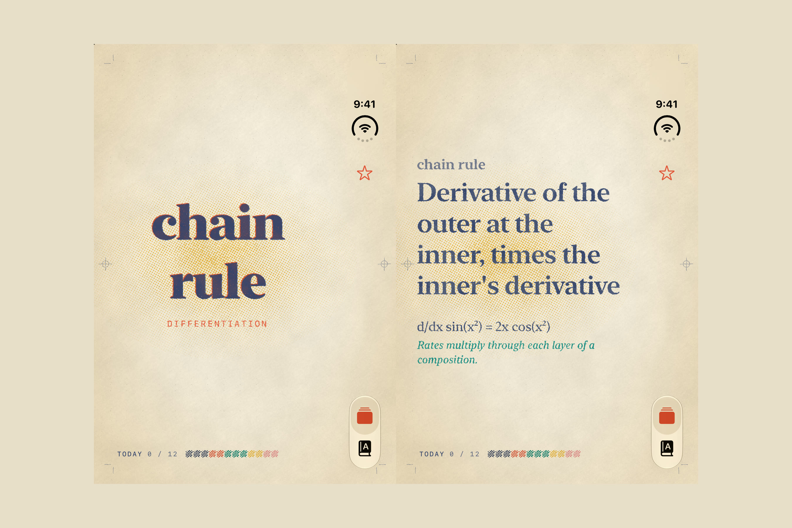
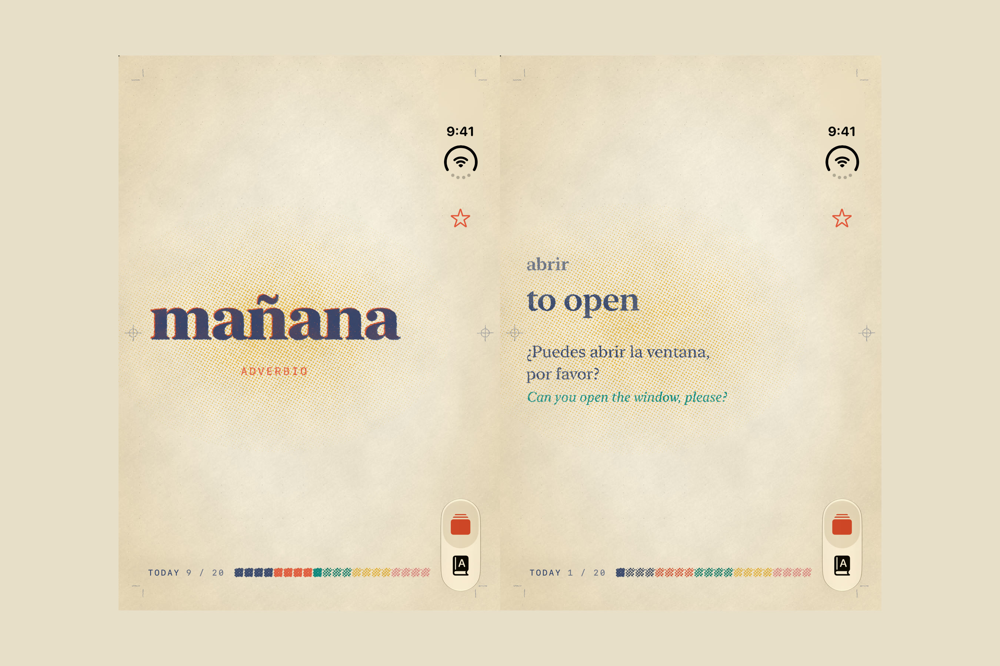
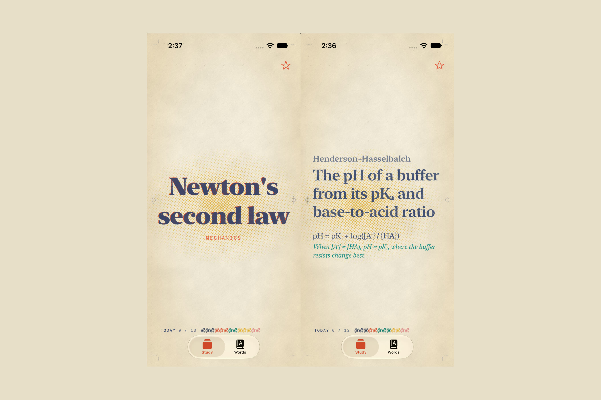

# duo-lingo 📖

**Flashcards for iPhone Duo. The question is on the cover; unfold to reveal the answer.**



Built solo at **Bitrig Hacks: iPhone Duo Edition** (YC, September 2026), in about four hours, with [Bitrig](https://bitrig.app).

## What it does

You can't peek at a closed book. duo-lingo puts one word or concept on iPhone Duo's cover display. You say the answer out loud, then unfold the phone to check it. The hinge *is* the reveal, so you always recall before you see the answer, and recalling is the part that builds memory.

### Core features

- **Fold, recall, unfold.** The question lives on the cover display. As the hinge opens, the answer *develops* on the left page like ink coming up on a print, a lamp of halftone comes on behind it, and the crease deepens with the fold.
- **Fold it shut to move on.** The card deals off the stack, and today's color bar prints a swatch for it.
- **Star what you missed.** A starred card comes back three cards later, until you clear the star.
- **Make a deck from any link.** Paste a URL (an article, lecture notes, a blog post, a Wikipedia page) and OpenAI turns it into short question-and-answer cards. Then fold and study them.
- **College decks built in.** 61 hand-checked cards across Biology, Chemistry, Physics, Calculus and Linear Algebra, plus Spanish and Japanese.
- **Unfolded, it's a book.** The inner display shows the decks beside their cards in a split view kept clear of the fold, and a tap turns the page when the phone is lying open on a table.
- **A riso-printed look.** Paper, ink and halftone are drawn per pixel by Metal shaders, not a texture overlay.

| | |
|---|---|
|  |  |

## Why folding works

In [Roediger & Karpicke (2006)](https://doi.org/10.1111/j.1467-9280.2006.01693.x), students who read a passage once and then tried to recall it three times remembered **61%** a week later. Students who re-read it four times remembered **40%**, and they predicted they'd do *better*. Feeling ready isn't remembering. Recalling is. A flashcard app with a reveal button makes peeking one tap away; a closed phone makes you answer first.

## How the hinge drives it

| Hinge | What happens |
|-------|--------------|
| **Closed** | The cover display shows the next card's question |
| **Partially open** | The answer develops in ink as the angle grows; the lamp warms and the crease deepens |
| **Fully open** | The whole answer, its example, and the example's translation or explanation |
| **Closed again** | The card is dealt away and marked known (or sent back three cards later if starred) |

- `onHingeChange` with `DeviceHingeContext` (closed, partially open, fully open, and the angle) drives the whole study loop.
- Compact width is the cover display, which shows only the card stack. Regular width is the inner display: a two-page spread, with the word on the right and the answer on the left.
- `reservedRegions(kind: .division)` finds the fold, so no text ever sits in the crease and the two pages bind into a book around it.

## The riso press

Four stitchable Metal shaders in [`Riso.metal`](App/Views/Style/Riso.metal), applied with SwiftUI's shader effects:

| Shader | What it prints |
|--------|----------------|
| `risoPaper` | Uncoated stock: broad uneven tone, cloudy formation, fiber tooth, and warm falloff at the edges |
| `risoHalftone` | Each ink screened at its own angle, with dots that swell unevenly like a drum laying down ink |
| `risoInk` | Solids that print blotchy and flecked, with the paper glowing through |
| `risoRoughen` | Edges that wander a fraction of a point, so type sits *in* the paper |

The deck-complete screen is a paper crane printed in three plates (mustard, vermilion, navy), each a hair out of register.

## Quick start

### Prerequisites

- Xcode with the iOS 27.1 SDK and the iPhone Duo simulator
- The Metal Toolchain: `xcodebuild -downloadComponent MetalToolchain`
- [XcodeGen](https://github.com/yonaskolb/XcodeGen): `brew install xcodegen`
- An OpenAI API key, for making decks from links (optional)

### Run

```bash
xcodegen generate --spec Project.json
open Project.xcodeproj
```

Run the `duo-lingo` scheme on the iPhone Duo simulator, then use the simulator's fold controls to close and open it.

### OpenAI key

The first time you make a deck from a link, the sheet asks for a key and keeps it on the device. For development you can also pass it at launch, as the scheme argument `-openAIKey sk-...`. The key is never compiled into the app.

## Architecture

```
Link → URLSession (fetch the page) → strip to plain text
     → OpenAI Responses API (gpt-5.4-mini, strict JSON schema) → cards
     → WebDeck (saved in UserDefaults) → "From a Link" shelf

Hinge → onHingeChange → FoldState (posture + angle)
      → StudySession.updateFold → reveal on open, deal on close
      → CoverDeck (cover display) / SpreadView (inner display)
      → Riso.metal shaders → the printed page
```

## Tech stack

- **App:** Swift, SwiftUI (iOS 27.1 SDK), iPhone Duo hinge and display APIs
- **Rendering:** Metal shaders via SwiftUI `layerEffect` / `colorEffect` / `distortionEffect`
- **AI decks:** OpenAI Responses API with Structured Outputs
- **Project:** XcodeGen
- **Built with:** Bitrig and its Claude Code harness

## License

MIT
